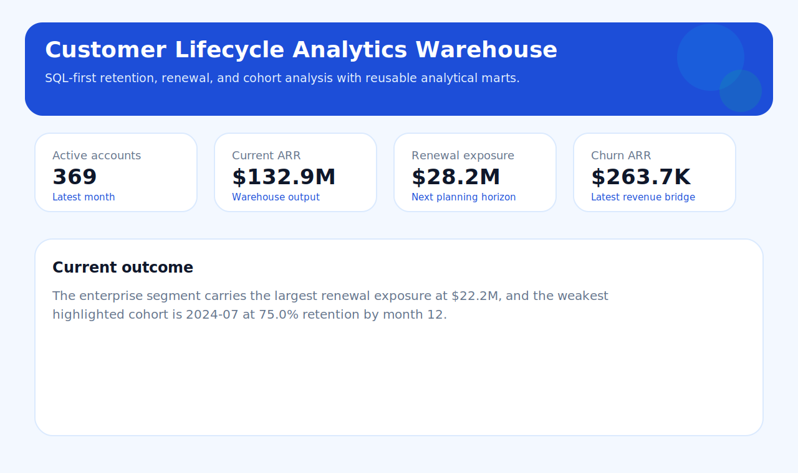
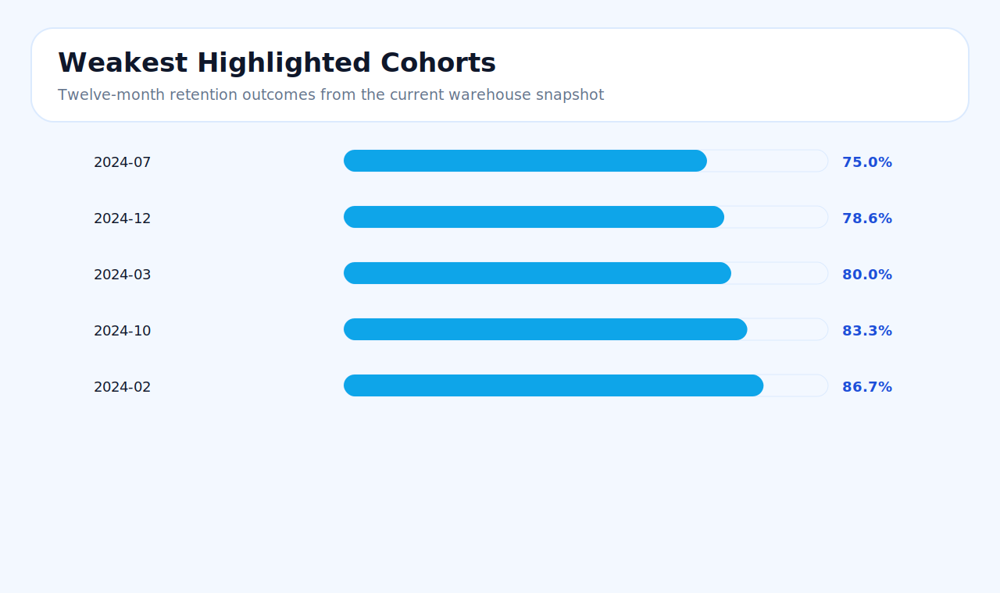

# Customer Lifecycle Analytics Warehouse

SQL-first analytics project designed to show how customer, revenue, retention, and marketing data can be structured into a reproducible warehouse workflow for business analysis and decision support.

## Overview

- Uses SQL as the core modeling layer for cohort retention, revenue bridge analysis, regional scorecards, channel efficiency, and account risk scoring.
- Generates realistic multi-region subscription data and loads it into a local SQLite warehouse so the project is runnable without external infrastructure.
- Produces analyst-ready outputs including curated CSVs, a metrics glossary, SQL query pack, written findings, and an HTML executive summary.
- Emphasizes business reasoning, metric definitions, and explainable analysis instead of only showing code structure.

## Visual Outputs





## Business Scenario

This project models a subscription business that needs a repeatable way to answer four recurring questions:

- Which cohorts are retaining well, and where do retention curves weaken?
- Which regions and customer segments carry the most renewal exposure?
- Whether growth is coming from acquisition, expansion, or simply masking churn pressure
- Which accounts or renewal groups need attention before revenue risk materializes

The workflow is structured the way an internal analytics or BI team would deliver it: raw operational data is standardized into reusable marts, then summarized into outputs that commercial, finance, and customer teams can review.

## What This Project Demonstrates

- Dimensional thinking across customer, month, region, segment, and acquisition channel
- Metric design for retention, net revenue movement, utilization, support pressure, and channel performance
- SQL modeling using CTEs, window functions, cohort logic, and layered marts
- Translating warehouse outputs into concise business findings and recommendations
- Building a reproducible local analytics workflow that can be extended to PostgreSQL, BigQuery, Snowflake, or dbt-style environments

## Analytical Workflow

1. Generate consistent source extracts for accounts, monthly product usage, invoices, and marketing spend.
2. Load the sources into a local warehouse.
3. Build a customer-month analytical layer that becomes the common fact grain for downstream analysis.
4. Derive reusable marts for retention, revenue movement, segment performance, renewal planning, channel efficiency, and account prioritization.
5. Export the marts into CSV, JSON, Markdown, and HTML deliverables that are ready for analysis or dashboarding.

## Project Layout

- `src/customer_lifecycle_sql_analytics/` contains the data generator, warehouse runner, and CLI
- `sql/` contains staging views, marts, and business question query packs
- `data/raw/` contains generated source data
- `data/warehouse/` contains the SQLite warehouse file
- `data/processed/` contains curated analytical exports
- `artifacts/` contains summary outputs and findings
- `docs/` contains architecture, metric definitions, and analysis notes
- `tests/` contains pipeline validation

## Quick Start

```bash
python -m venv .venv
source .venv/bin/activate
python -m pip install -e .
python -m customer_lifecycle_sql_analytics.cli run-all --accounts 420 --months 24
```

## Main Outputs

After `run-all`, the project writes:

- `data/warehouse/customer_lifecycle_analytics.db`
- `data/processed/cohort_retention.csv`
- `data/processed/revenue_bridge.csv`
- `data/processed/region_scorecard.csv`
- `data/processed/channel_efficiency.csv`
- `data/processed/segment_performance.csv`
- `data/processed/renewal_pipeline.csv`
- `data/processed/at_risk_accounts.csv`
- `artifacts/dashboard_snapshot.json`
- `artifacts/analysis_findings.md`
- `artifacts/executive_summary.html`

## Core SQL Models

- `vw_account_monthly_health`
  Unified customer-month view with ARR, seats, utilization, support, satisfaction, and renewal timing
- `mart_cohort_retention`
  Cohort retention table by signup month and months-since-signup
- `mart_revenue_bridge`
  Monthly revenue movement split into new, expansion, contraction, and churn components
- `mart_region_scorecard`
  Region-level scorecard for active accounts, ARR, utilization, retention, and renewal exposure
- `mart_channel_efficiency`
  Acquisition channel view combining marketing spend and customer outcomes
- `mart_segment_performance`
  Segment-level monthly view for ARR, utilization, satisfaction, and renewal planning
- `mart_renewal_pipeline`
  Renewal planning table grouped by time window, region, and segment for intervention tracking
- `mart_at_risk_accounts`
  Prioritized account list based on declining usage, ticket pressure, satisfaction, and renewal proximity

## Business Questions It Answers

- Which signup cohorts are retaining best over time, and where does retention degrade earliest?
- Which regions are carrying the highest renewal exposure and weakest product engagement?
- Which customer segments deserve the most retention focus in the next planning cycle?
- Is growth being driven by new customer acquisition, expansion within existing accounts, or both?
- Which acquisition channels create the healthiest long-term accounts rather than only top-of-funnel volume?
- Which accounts should commercial or customer teams review first based on risk indicators?
- Which renewal buckets are the most exposed, and how much of that book already shows intervention signals?

## SQL Techniques Used

- layered CTEs for readable model construction
- cohort calculations based on signup month offsets
- window functions for prior-period ARR comparisons
- conditional aggregation for revenue bridge and renewal exposure metrics
- reusable marts that can be published directly into reporting tools
- SQL question packs and quality checks to support analyst workflows

## How To Read The Warehouse

Start with:

1. `docs/metric_glossary.md`
2. `data/processed/region_scorecard.csv`
3. `data/processed/segment_performance.csv`
4. `data/processed/cohort_retention.csv`
5. `data/processed/revenue_bridge.csv`
6. `data/processed/renewal_pipeline.csv`
7. `artifacts/analysis_findings.md`

Then use:

- `sql/020_quality_checks.sql` to validate the warehouse outputs
- `sql/030_business_questions.sql` to inspect the warehouse directly

## Production Path

- Replace synthetic inputs with CRM, billing, product usage, and marketing platform extracts
- Move the warehouse to PostgreSQL or a cloud analytical database
- Add incremental loading, orchestration, and model versioning
- Convert the SQL layer into dbt models if the surrounding stack uses dbt
- Publish curated marts to BI tools such as Power BI or Tableau
